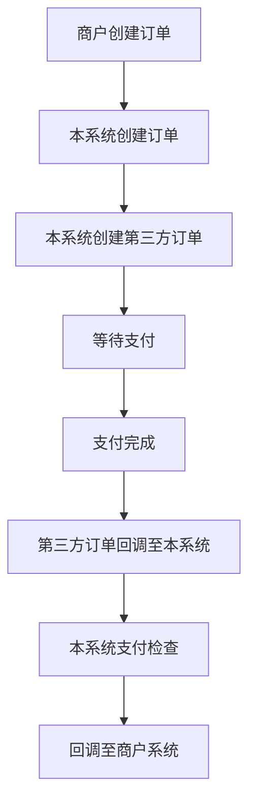
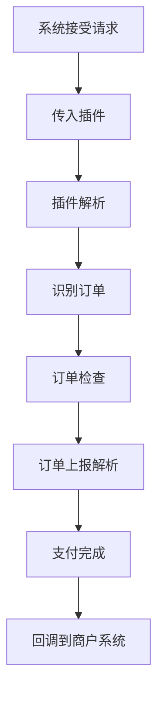

# 回调常见问题

**一切问题先看项目日志,看群公告,看文档**

## 系统中支付流程如下

### 上报流程

### 上报问题排查
请按照上面的流程,排查下自己在什么节点出的问题,以便后续操作

## XArrPay 显示支付成功,但是回调一直失败
检查商家系统的回调方式是POST还是GET,如果需要为GET,那么就在后台设置易支付回调方式为GET

## 支付宝手机/电脑支付等官方渠道不回调

#### 解决方案

1. 进入官方网站-诊断工具-异步通知

    https://opensupport.alipay.com/support/diagnostic-tools

**如图所示**

## 回调是 `http://` 开头导致301 但是开启了强制ssl无法回调

如实际地址为 `https://www.xarr.cn/notify`

结果传递给第三方的为 `http://www.xarr.cn/notify`

导致出现了301

#### 解决方案
将反向代理编辑好 go项目需要直接绑定域名到go项目

