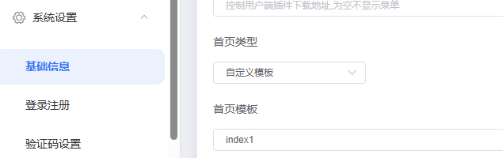

# 首页自定义模板

首页可设置为**自定义模板**,不再是系统写死的默认首页。模板是一套静态 HTML + `manifest.json`,经后端模板引擎渲染后返回。

## 开启方法

在系统设置中:
1. 将「首页类型」设为「自定义模板」;
2. 在「首页模板」下拉中选择要使用模板的 `name`(即目录名)。



## 文件分布

```
templates/index/模板名称/
├── index.html       # 首页文件(唯一入口,首页是单页模板)
├── manifest.json    # 主题元数据(id,展示名,类型等)
└── assets/          # 静态资源(js/css/图片) —— 唯一可被外部访问的路径
```

- 系统内置模板:`default`、`index1`、`shop`、`vip_buy`,见 `merchant-server/templates/index/`。
- 模板文件本体不可直接 URL 访问,其中 `assets/` 目录可通过 `/.templateAssets` 变量拼接访问。

> ⚠️ **首页模板同样必须带 `manifest.json` 才能被后台识别**(与支付模板一致)。首页目录下的 `manifest.type` 必须为 `2`。
> 完整开发指南见 [模板开发](dev)。
